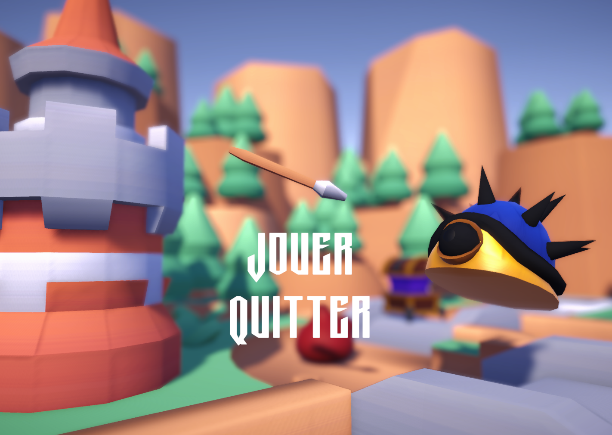
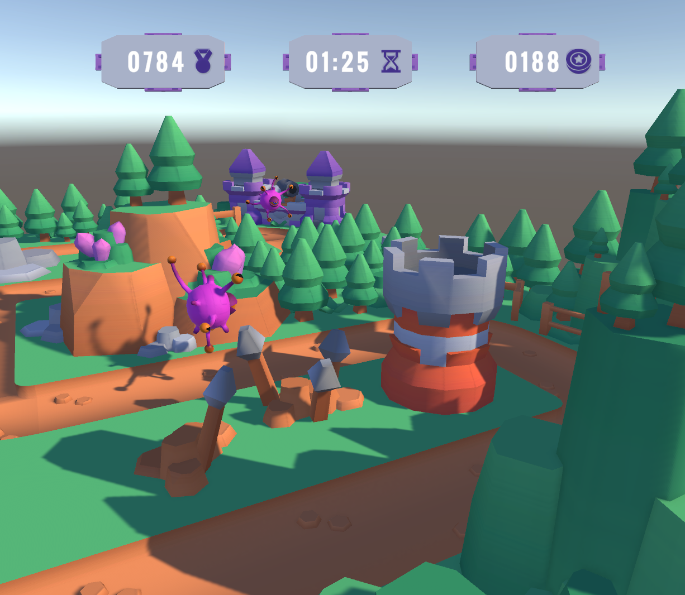
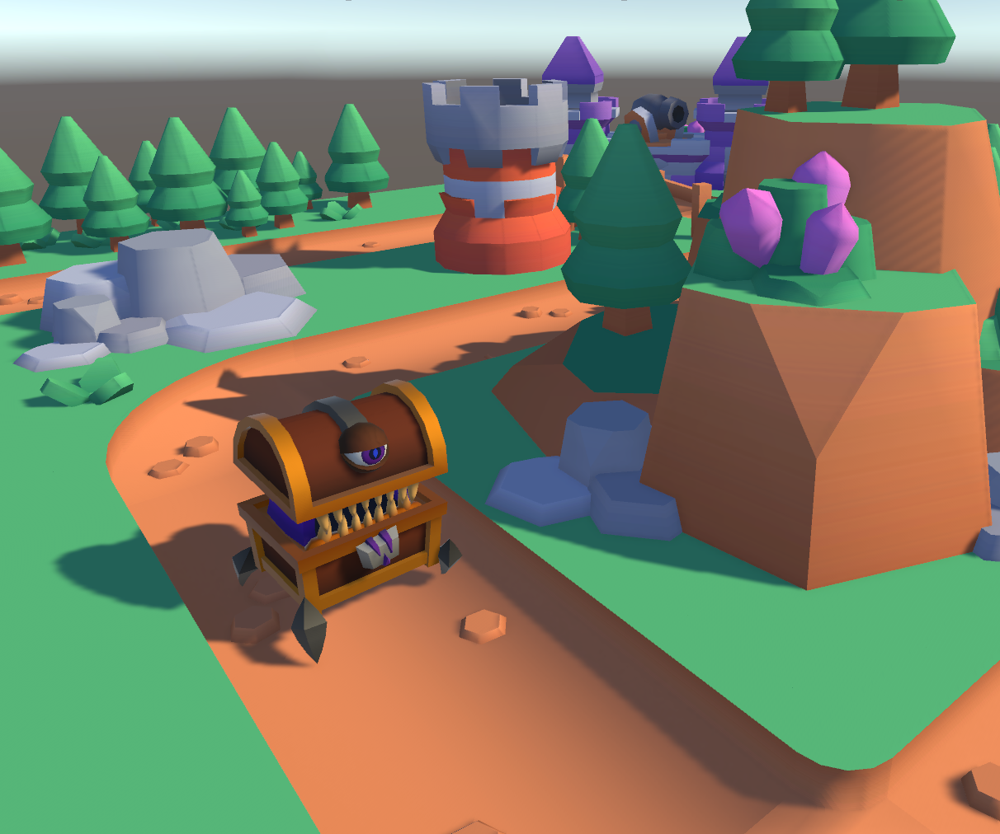

## A simple Tower-Defense

We present a tower-defense mini-game made in Unity and coded in C++ compiled into a usable plugin !

## Gallery

## Our team

[Jolyne](https://github.com/jolyne-mangeot)

[Adeline](https://github.com/AdelinePat)

[Florence](https://github.com/Florence-Navet)

## Credits

"That Zen Moment " Kevin MacLeod (incompetech.com)

"Dewdrop Fantasy" Kevin MacLeod (incompetech.com)

Licensed under Creative Commons: By Attribution 4.0 License
http://creativecommons.org/licenses/by/4.0/