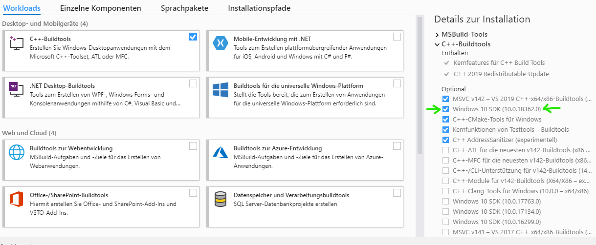
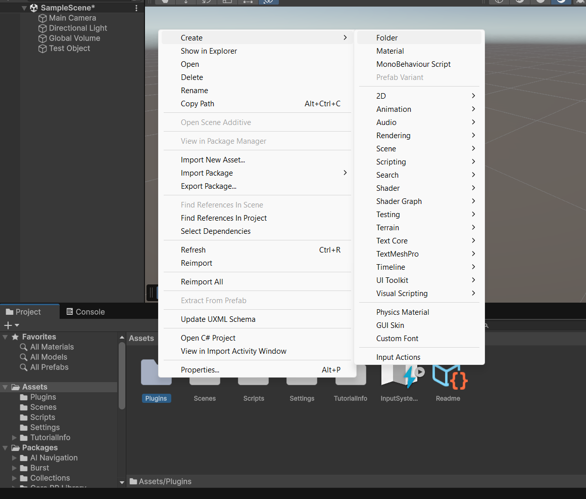
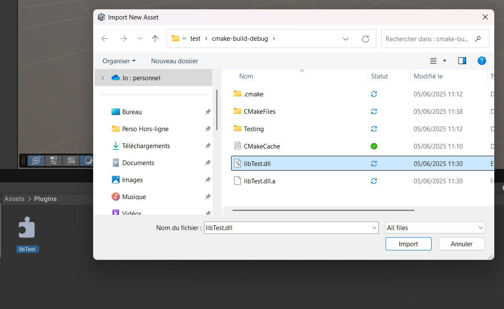
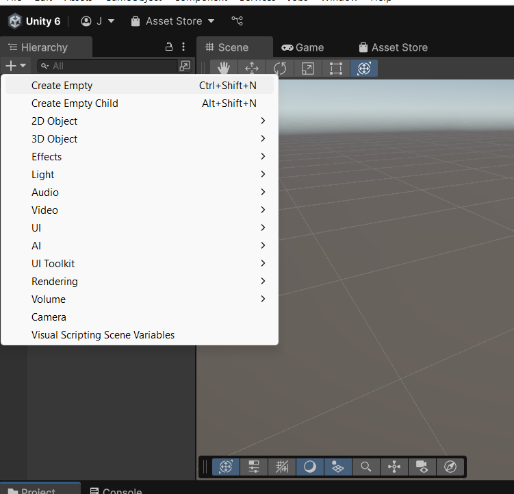
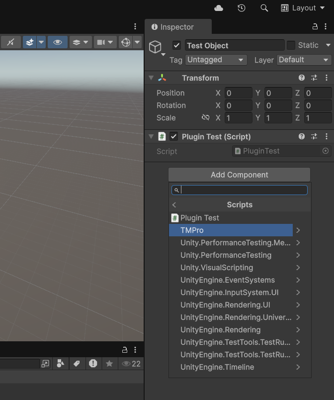

#### ** A IGNORER **

Il est possible d'[installer gratuitement Visual Studio](https://visualstudio.microsoft.com/fr/downloads/), ce qui prendra du temps et de l'espace disque (env. 30Go). Notez à bien cocher les différents outils référant à C++ ! (chercher l'icône référant ici à C++ BuildTools, ainsi que le paquet faisant référence à Unity, et tout autre que vous trouveriez pertinent, notamment dans l'onglet paquets individuels, à votre préférence)



Lorsque l'installation de Visual Studio tourne, nous avons l'occasion de voir la structure d'une compilation de librairie .dll. Celle-ci se fait, par chance, à l'aide d'un fichier Cmakelist, permettant ainsi la création d'un fichier .dll ainsi que, dépendant de nos besoins, d'un fichier main.cpp que l'on pourrait tester avec nos classes, structures, etc. Nous ne verrons ici toutefois uniquement la compilation d'un fichier .dll, voici d'ailleurs un template de Cmakelists.

#### ↓ VRAI DEBUT DU README ↓

## README de l'installation des outils pour développer des plug-ins en C++ pour un projet Unity Engine

Unity, moteur graphique tourné jeu-vidéo, permet initialement de coder en C#. Toutefois, il est possible de générer des plug-ins importables dans notre projet, et ce, en langage C++ à l'aide de la compilation en librairies .dll, qui sera expliquée plus tard.

Pour ce faire, il est donc indispensable d'installer Unity. Il faut [se créer un Unity ID et installer l'Unity hub](https://unity.com/fr). Si la création de compte ne fonctionne pas (captcha en boucle, erreurs, etc.), il faut tester soit de se connecter directement avec Google, ou bien tenter d'installer le hub et de s'y connecter avec Google dessus directement (à tester).

Une fois l'Unity Hub lancé, installer l'Engine Unity 6 et patienter. Lancer un projet vide dessus permettra d'installer les paquets manquants.

Avant de travailler dessus, nous pouvons commencer à mettre les aspects C++ en place et en expliquer les aspects. Unity est capable de détecter et lire certaines librairies .dll, compilées depuis différents langages.

```
cmake_minimum_required(VERSION 3.13)

project(Test)

set(CMAKE_CXX_STANDARD 14)
set(CMAKE_WINDOWS_EXPORT_ALL_SYMBOLS ON)

add_library(Test SHARED
        test.cpp)
```

Il suffit alors d'indiquer la version de Cmake, le nom de notre projet, le langage utilisé ainsi qu'activer les symboles spéciaux (car Unity fonctionne avec beaucoup d'entre eux), puis former notre librairie en y incluant nos fichiers. Il ne devrait pas être nécessaire de créer plusieurs librairies pour le jeu final, toutefois, il serait sage de diviser les responsabilités en grande catégories (portant au jeu, portant aux paramètres, affichage, etc., portant sur le gameplay...).

En effet, la simple déclaration de nos classes, méthodes, pointeurs, etc. permettra à nos scripts écrits en C# d'en récupérer tous les noms grâce à un namespace spécial.

Afin de le voir en conditions réelles, voici du code à intégrer dans nos fichiers test.cpp, trouvable sur le repository sur la branche "tower-defense-unity", dans le dossier test (pour lequel on a créé un fichier Cmakelist vide que l'on a assigné à nos fichiers).

```
test.cpp

#include "test.hpp"

extern "C" {
    __declspec(dllexport) int Multiply(int a, int b) {
        return a * b;
    }
}
```

Ce code montre une simple fonction retournant une multiplication, en int, castée dans le format d'export en librairie .dll (que l'on verra ne réfèrera en fait jamais à un int lorsque le .dll est importé). Lorsque Clion a bien détecté notre fichier Cmakelists, il est donc temps de le build. Il faut donc simplement cliquer sur l'icône marteau, puisque notre build ne va pas engendrer la création d'un exécutable. Le résultat est retrouvable à l'adresse "cmake-build-debug/libTest.dll", et ce sera ce fichier précis qu'il faudra copier dans notre projet Unity.

Ce projet, d'ailleurs, que nous allons débuter. Pour ce faire, il suffit de reprendre le projet vide créé lors de l'installation (ou d'en créer simplement un nouveau, quelque soit son emplacement, mais noter le bien tout de même).

Dans l'interface du projet, que l'on devra prendre le temps de découvrir, il faudra dans l'onglet "Projet" entrer dans le dossier "Assets", et y créer un dossier nommé "Plugins" :



Dedans, un simple clique droit et "Import New Asset..." nous permettra de sélectionner notre fichier .dll compilé plus tôt, et il y apparaîtra :



Ce fichier en lui-même, toutefois, ne sera pas lu automatiquement par Unity, ainsi qu'il ne saura pas ce que celui-ci contient. C'est alors qu'il nous faut créer un Script en C# capable de lire et mettre cette librairie en marche. En retournant dans le dossier Assets, il suffit de créer un dossier Scripts, et, à l'intérieur, créer un "Mono Behaviour Script" nommé "PluginTest", un script référant à un comportement, et que l'on peut intégrer à un objet en jeu. À l'intérieur, il s'agira donc de faire la passerelle entre les langages, et de coder un programme qu'Unity pourra lire.

Pour modifier le fichier, il est possible de l'ouvrir en double-cliquant dessus, ce qui ouvrira VSCode ou un équivalent, et l'on peut y copier ceci :

```
PluginTest.cs

using System.Runtime.InteropServices;
using UnityEngine;

public class PluginTest : MonoBehaviour
{
    [DllImport("libTest")]
    private static extern int Multiply(int a, int b);

    void Start()
    {
        int result = Multiply(2, 3);
        Debug.Log("2 * 3 = " + result); // Devrait afficher : "2 * 3 = 5"
    }
}
```

En utilisant les namespace, on crée une classe fille de MonoBehavior, et l'on y ajoute des attributs personnalisés, donc un, nommé "[DllImport("PluginTest")]" -> le nom ici devant être littéralement celui de notre Plugin. Notez qu'à chaque modification du fichier, Unity le recompile automatiquement avant qu'il puisse être utilisé, et d'ailleurs, c'est ce que nous allons faire.

Pour appliquer notre script de comportement à un objet, il est nécessaire d'en créer un : dans le coin supérieur gauche, où se trouvent nos scènes, nos objets et la caméra, il suffit de créer un nouvel objet vide, que l'on nommera test :



En faisant glisser depuis le fichier script affiché en bas et sur notre élément dans la liste d'objet, ou en le sélectionnant afin de le modifier dans l'inspecteur (à droite et sur l'image), il est possible d'ajouter notre script comme composant à l'objet :



Lorsque le script est ajouté, il est alors possible de lancer notre jeu et voir le résultat dans la console (deuxième onglet à "Project", en bas de la preview).